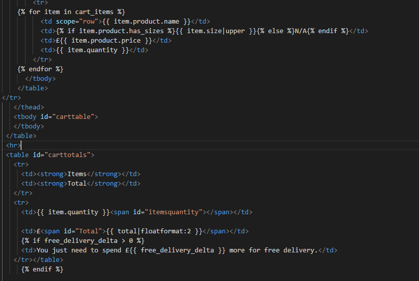
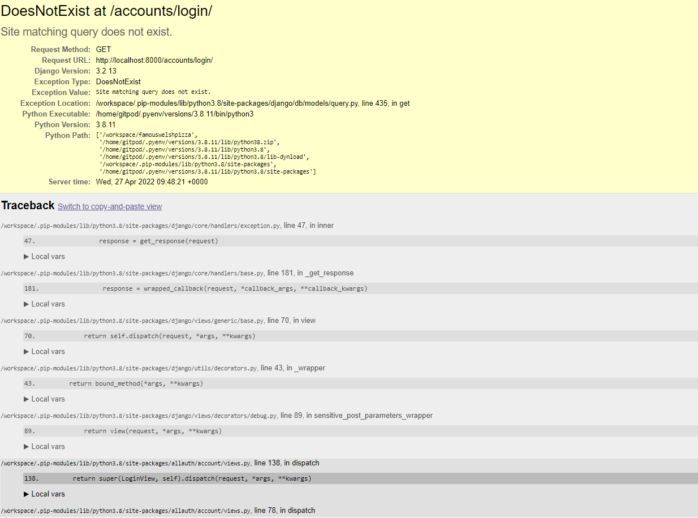
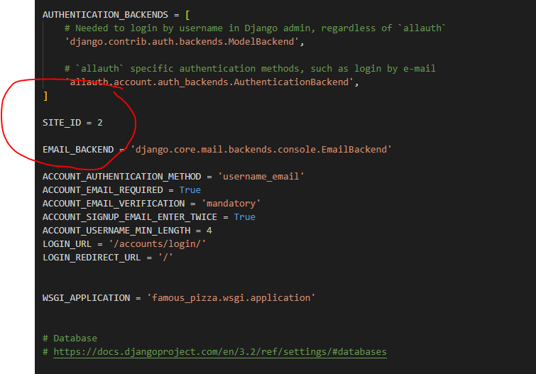
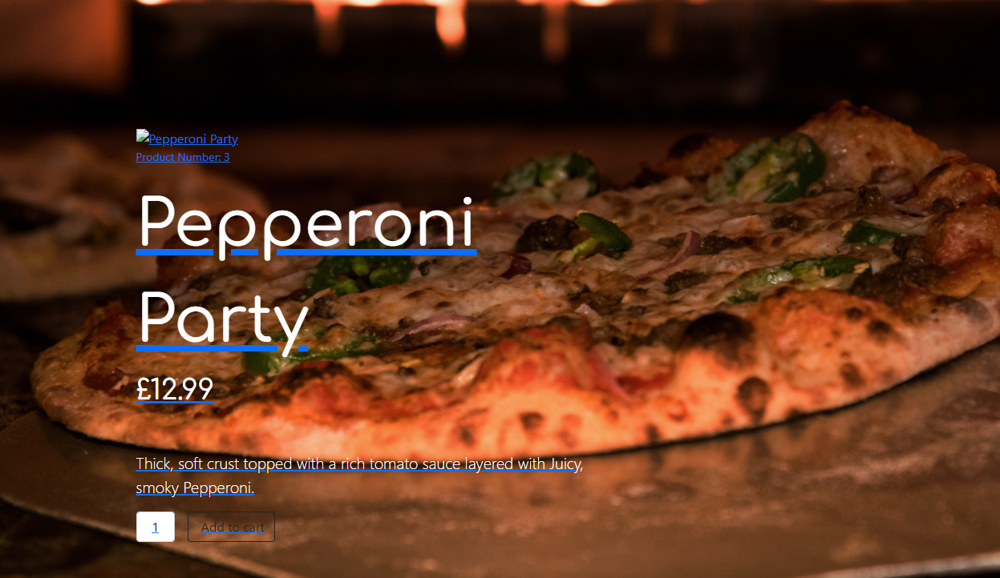
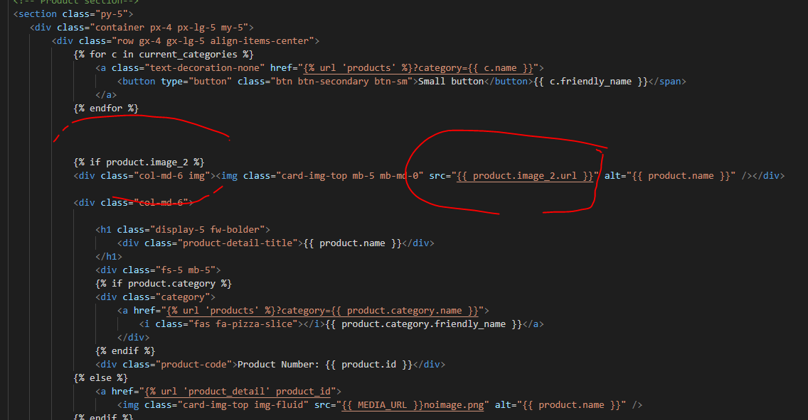
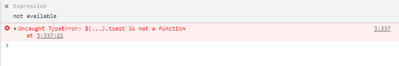

# MILESTONE 4 - Full Stack Frameworks with Django

Github Link:

Website is hosted via Heroku and can be found via link :

# Purpose of this project – Milestone 4

This project idea was based on a common e-commerce website where user has the ability to view pizza related food products, register their details and process a transaction for payment of the items to be delivered.

Users can view all website content but cannot select and/or process an order without first registering their account, login in to their account and setting up payment details in order for payment to be made and the delivery process to be initiated.

The website will include details of products by category and include tags , making the process of search much easier for the user.

The user can view their cart content and be able to add or remove to their order before confirming payment transaction .

# Project Idea

Pizza order and delivery service.

# Name Ideas
Famouswelshman Pizzas
Famous Pizza
Pizza Time

# Main Technologies

### Required: 
HTML, CSS, JavaScript, Python+Django
Relational Database(Recommending MySQL)
Stripe Payments

### Optional
Bootstrap material design
Materialize (Pre built page layout)
Royalty free web content

# User Stories
* User can view all products
* New visitors want to be able to search for deals and exact products
* Users want to register their details and create an account
* User wants to add or remove items 
* User wants to view all products in checkout cart
* Registered Users want to complete payment of products for delivery service

## User Story 1
New to site users can view all pizza product content by topic either in the dropdown navbar or by clicking on the buttons shows on homepage. Homepage has two buttons which direct user to either full menu which includes everything or some deals products so as to mimize the need to search through entire menu.

## User story 2
User can search via homepage searchbar for words which will then return all products synonymous with their search request and products are grouped under categories therefore by clicking on a heading i.e - meat eaters will return all results for meat based products pertaining to that link.

## User Story 3
User can setup an account via registration link which enables the customer to add or remove products from their checkout cart. Product information is restricted to the current customer and cannot be viewed by other account registered users. Registered users account details will be secure to their account.
Registered user can edit and delete their profile details. Registered user can logout of their account until next login.

## User Story 4
Registered user/user can select item by size and quantity, which will then be added to their shopping cart, can also remove products and proceed to checkout.The user can then process payment of their order.

## User Story 5
User can logout from their account and return at another time to view their previous order products and details.

---------------------------------------------------------------------------------------------------------------------------------------------------------------------------------

# Structure

# Website UX
The front-end of the project website gives the user immediate view of the website content and purpose by display of navbar and search bar along with the Pizza branding logo. Home page displays options to quickly go to product variables or search the site for items associated with their search. The ability to add products is straight forward and the product details pages allows for more in depth view and description of the item along with a quantity selector and size dropdown making the process of selecting size and amount straightforward and within two clicks. The user at any point in the process can simply click on their shopping cart allowing instant display of all or any products they might have ordered. The simplicity of the cart allows the user to quickly remove and items and/or return to either the home page of products. The key to their experience is that items such as ‘Deals’ are visually evident from the home page and from selection of products to checkout, the user gets a linear guide through the process of purchase making the experience simple and effective. The addition of pop-up toasts message cards upon adding or deletion of products also improves user experience since at any point the user is aware of what and why they have added or removed products before completing transaction of payment. 

## Features
* Able to search homepage and reveal any products linked to the word or words used by search criteria.
* Products are returned in groups such as 'Meat Eaters' and 'Vegetarian'.
* Checkout cart view shows all itemised product, quantity, size and price making it clear to the user before checkout.
* User ability to create, esit and delete products in their shopping cart.
* Ability to create and update user login/profile.

### Nice to have Features
The project was setup to include a dropdown and function for recording one of three sizes per item. This was part of the model setup for products but since there would be a lot more, inctricate code required for functionality it was not explored further. Future projects would show that selection by size would have effect on the price range therefore an if statement would be required when adding to cart which would decide if by size = price and further functionailty would be availabe especially in instance such as my project where products would be ordered based on size/amount.

## Future Features
Bakcground animation - Pizza being cooked.

# MS4 Wireframes - Balsamic
My design and styling idea for a pizza ordering service had to include some rustic background photos of said product being either cooked or served. I wanted to incorporate warm colours for images and background acentuating the fire and glow of a pizza oven. I chose the font that shows throughout the website as it gives a nice rounded feel to the text and a homely, earthy expression to the user. I attempted to call and display products in small card formats upon search or click and then show item details in full upon click. The background would remain throughout as a subtle backdrop and I purposely used dark color when there was no image present to highlight the text. I wanted to keep the shopping cart layout simple and responsive with the payment form easy to complete on all sized media. 

## Desktop Home Page Template

## Desktop Products Page Template

## Checkout cart and payments Template

---------------------------------------------------------------------------------------------------

# VALIDATION

# Code Validation
## HTML
HTML code for all pages passed through W3C Markup Checker shows some warnings and errors in relation to Jinja templating. I have also been made aware of some divs which
remain open but closing these completely corrupts the display of the containers, something I learnt late in the project before submit.

## CSS

## Javascript

--------------------------------------------------------------------------------------------------------

# Testing

## Bugs

1) Quantity amount not displayed in the cart.html. The variable used here was {{ item.quantity }} which 
Was bringing through the items loop information 

I checked the items dictionary but the error was in the contexts.py file where ‘item_data’ was written instead of ‘quantity’ which then pulled through the quantity value to the Cart.

2)

Following the install of ‘allauth’ upon attmepting to run the code I was faced with this error.

A common fault with ‘allauth’ is the SITE_ID in settings therefore where as the default is = 1 and ‘allauth’ then finds the site, this wasn’t happening therefore I was advised to change this to = 2 which corrected the problem.

3) In order to display the products images, it was required that the exact product field name was added to the code. Since I added an additional image to the Django database under the ‘Products’ model then there would be a need to change the image field name to that respective name. Upon click of the product image 1, the site then directs us to a product detail page where the second image for the product would then show.

In order to fix this and display the correct image field, I adjusted the  which accounts for image field in Django database to the Image 2 field in the Django database which then displayed the correct image under the Products header.

4) Unable to display ‘Toast’ messages. Console shows that toast is not a function.

The message-container does not show in the HTML but I tested this by adding it into the home/index.html and the elements section under Inspect in browser shows the message-container comes through but the same error message exists in the console. I tried changing the order of importance with Jquery script but this also did nothing.

Since I could not resolve this issue I have added this message function in the ‘Nice to have features’ for future projects of similar nature.
Adding a print statement to the ‘add to cart’ function in the cart views.py renders the return in the terminal but it doesn’t prompt the execute of the toast function.
After some research and discussion it seems that the issue with 'Toasts' is in relation to the current Bootstrap5 program which would render the toast function useless. I was advised to incorporate script link to Bootstrap4 in order for the toast messages to be successful but decided against this as the templates and css were already setup and adjusted to work with Bootstrap5.

5)

## Account creation

## Functionality

## HTML

## CSS

## Javascript

## Django
Project Apps

Cart
Products

# Project Challenges
>
>
>
>

# Deployment

## Github

# Gitpod

## Heroku

# Media Credits

# Credits
Pizza Background Picture
Photo by Eneida Nieves: https://www.pexels.com/photo/baked-pizza-on-pizza-peel-in-oven-905847/
Pizza Variety photos from - https://www.pizzarecipe.org/different-types-of-pizza/
Caprina Pizza Image - Photo by Vincent Rivaud: https://www.pexels.com/photo/top-view-photo-of-baked-pizza-2147491/
Broccolli Pizza Img - https://www.KitchenKonfidence.com & https://www.streaminggourmet.com
Proscuitto Pizza Img - Photo by Pixabay: https://www.pexels.com/photo/cheese-close-up-cooking-crispy-263041/
Napolitana Pizza Img - Photo by Victor Miyata: https://www.pexels.com/photo/pizza-on-brown-wooden-table-3682837/
Cheese Pizza Image - Photo by JÉSHOOTS: https://www.pexels.com/photo/dinner-fast-food-lunch-meal-3644/

## Other Credits
StartBootstrap - E-Commerce template downloaded and customized for project
Google Fonts - Comfortaa Font for main website font styling
Font Awesome - Logos and links
Coca Cola, Fanta and Sprite Logos - Saved as images from Google Images - Logos are copyright protected used in this project for demonstration purposes.
Deals Image used courtesy of - https://stock.adobe.com/uk/

## Libraries used
* Django / MySQL Database
* Bootstrap used for content styling. (HTML/Js & css)
* Font Awesome for font and symbols.
* StartBootrstrap used for pre-built page layouts.
* Jquery (Javascript) included in the project for front end animation of buttons and navbar, dropdown etc.
* GitHub used for Git version control and Gitpod was used for IDE.
* Heroku used for deplyment of the application.
* Shopping cart template was downloaded from - https://www.codehim.com/
* Template for order details form credited to - https://colorlib.com/wp/bootstrap-form-templates/

